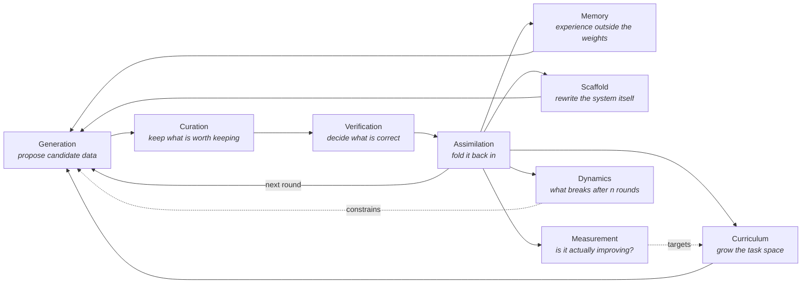
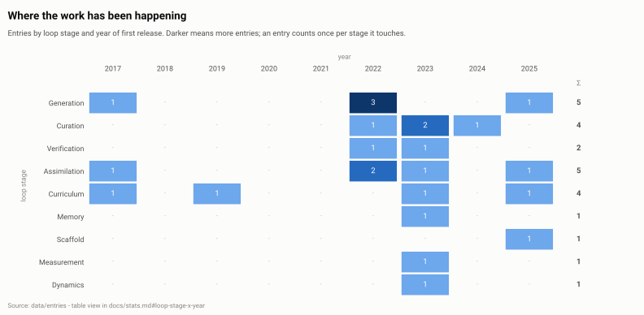
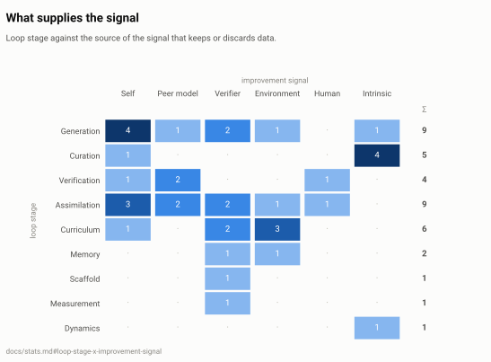
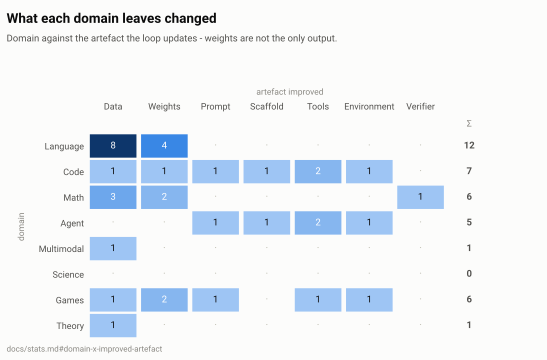
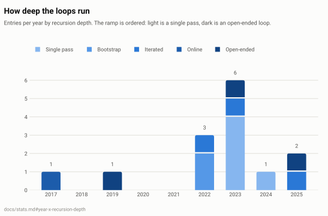
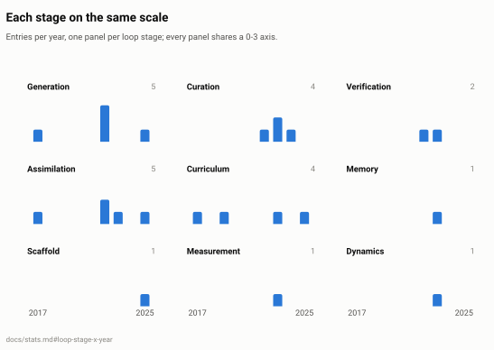
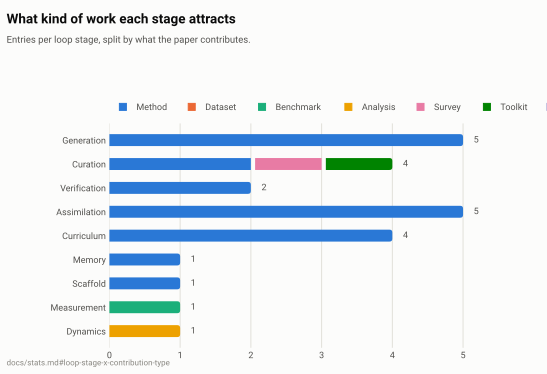

<!-- GENERATED FILE - prose lives in templates/README.template.md, data in data/; run `make build`. -->
<div align="center">

# Awesome Data-Centric Recursive Self-Improvement

**A curated, machine-checked survey of systems that get better by improving their own data.**

[](https://github.com/xubinrui/Awesome-Data-Centric-RSI/actions/workflows/ci.yml)     [](https://awesome.re)

**14** entries · **2017-2025** · **50%** run the loop more than once (`iterated`, `online` or `open-ended`) · biggest section: **Data Generation & Synthesis** (4)

</div>

---

## Scope

**Recursive self-improvement (RSI)** is usually told as a story about weights: a model
trains a better model, which trains a better model. In practice, almost every working
loop today improves *the data* instead - what gets generated, what gets kept, what gets
verified, and what comes back as training signal. This list tracks that literature.

An entry belongs here when it answers at least one of these, **inside a loop**:

- Where does new training data come from when the annotators run out?
- What decides whether a generated sample is worth learning from?
- What happens to a system that has been consuming its own output for *n* rounds?
- What does the loop leave behind - weights, a corpus, a skill library, its own source code?

Out of scope: data work with no feedback into the system that produced it, model
architecture or optimiser work with a fixed corpus, and capability reports without a
described loop. The full rules, including how borderline cases are decided, are in
[docs/methodology.md](docs/methodology.md).

## The loop



The nine sections of this list are the nine boxes above. An entry is filed under the box
its contribution lands on and tagged with every other box it touches.

## At a glance

<p align="center">
  <picture>
    <source media="(prefers-color-scheme: dark)" srcset="assets/figures/timeline-dark.svg">
    
  </picture>
</p>

<table>
<tr>
<td width="50%" align="center">
<picture>
<source media="(prefers-color-scheme: dark)" srcset="assets/figures/stage-signal-dark.svg">

</picture><br><sub>Loop stage against the source of the improvement signal</sub>
</td>
<td width="50%" align="center">
<picture>
<source media="(prefers-color-scheme: dark)" srcset="assets/figures/domain-artifact-dark.svg">

</picture><br><sub>Domain against the artefact the loop leaves changed</sub>
</td>
</tr>
<tr>
<td width="50%" align="center">
<picture>
<source media="(prefers-color-scheme: dark)" srcset="assets/figures/recursion-mix-dark.svg">

</picture><br><sub>How deep the loops go, year by year</sub>
</td>
<td width="50%" align="center">
<picture>
<source media="(prefers-color-scheme: dark)" srcset="assets/figures/stage-trajectories-dark.svg">

</picture><br><sub>Per-stage trajectories as small multiples</sub>
</td>
</tr>
<tr>
<td width="50%" align="center">
<picture>
<source media="(prefers-color-scheme: dark)" srcset="assets/figures/stage-contribution-dark.svg">

</picture><br><sub>What kind of work each stage attracts</sub>
</td>
</tr>
</table>

<sub>Figures are regenerated by `make figures` from `data/`; every number behind them is in [docs/stats.md](docs/stats.md) as a table.</sub>

## How to read an entry

Every entry carries the same six dimensions, so the list can be re-cut along any of them
(see [docs/index-by-dimension.md](docs/index-by-dimension.md)):

| Field | Question it answers | Values |
| --- | --- | --- |
| **Loop stage** <sub>(one or more)</sub> | Which turn of the data flywheel does this work act on? The first value decides which README section the entry is filed under. | `generation`, `curation`, `verification`, `assimilation`, `curriculum`, `memory`, `scaffold`, `measurement`, `dynamics` |
| **Improvement signal** <sub>(one or more)</sub> | Where does the signal that separates good data from bad data come from? | `self`, `peer-model`, `verifier`, `environment`, `human`, `intrinsic` |
| **Recursion depth** <sub>(one)</sub> | How many times does the output of the loop re-enter its own input, and does the loop get to change its own problem space? | `single-pass`, `bootstrap`, `iterated`, `online`, `open-ended` |
| **Improved artefact** <sub>(one or more)</sub> | What does the loop actually leave changed? | `data`, `weights`, `prompt`, `scaffold`, `tools`, `environment`, `verifier` |
| **Domain** <sub>(one or more)</sub> | Where is the loop demonstrated? | `language`, `code`, `math`, `agent`, `multimodal`, `science`, `games`, `theory` |
| **Contribution type** <sub>(one)</sub> | What kind of artefact is the paper itself? | `method`, `dataset`, `benchmark`, `analysis`, `survey`, `toolkit`, `position` |

An entry line looks like this:

> - **[Paper title](https://arxiv.org/abs/0000.00000)** · Author et al. · Venue 2024 · [code](https://example.com)<br>
>   <sub>One sentence on what the loop does.</sub><br>
>   <sub>**loop** `iterated` · **signal** `verifier` · **also** `curation` · **artefact** `data` `weights` · **domain** `math` · **type** `method`</sub>

`loop` is the recursion depth, `signal` is what separates good data from bad, `also`
lists the other stages the work touches, and `artefact` is what the loop leaves changed.

## Contents

| # | Section | Entries | Short name |
| --: | --- | --: | --- |
| 1 | [Data Generation & Synthesis](#data-generation--synthesis) | 4 | Generation |
| 2 | [Selection, Filtering & Mixing](#selection-filtering--mixing) | 3 | Curation |
| 3 | [Verification, Reward & Judging](#verification-reward--judging) | 1 | Verification |
| 4 | [Assimilation & Self-Training](#assimilation--self-training) | 1 | Assimilation |
| 5 | [Task, Curriculum & Environment Generation](#task-curriculum--environment-generation) | 1 | Curriculum |
| 6 | [Experience, Memory & Skill Libraries](#experience-memory--skill-libraries) | 1 | Memory |
| 7 | [Scaffold & Self-Modification](#scaffold--self-modification) | 1 | Scaffold |
| 8 | [Benchmarks & Measurement](#benchmarks--measurement) | 1 | Measurement |
| 9 | [Loop Dynamics, Limits & Safety](#loop-dynamics-limits--safety) | 1 | Dynamics |

- [Contributing](#contributing) · [How this list stays correct](#how-this-list-stays-correct) · [Citation](#citation)

---

### Data Generation & Synthesis

> Producing new training data - instructions, traces, problems, proofs, rollouts - from a model, a program, or a simulator rather than from human annotators.

<sub>`stage: generation` · 4 entries · [definition](docs/taxonomy.md#data-generation--synthesis) · [back to contents](#contents)</sub>

- **[Constitutional AI: Harmlessness from AI Feedback](https://arxiv.org/abs/2212.08073)** · Bai et al. · arXiv 2022<br>
  <sub>Replaces human harmlessness labels with a written constitution: the model critiques and revises its own answers, then a preference model is trained on those AI-authored comparisons.</sub><br>
  <sub>**loop** `bootstrap` · **signal** `self` `peer-model` · **also** `verification` `assimilation` · **artefact** `data` `weights` · **domain** `language` · **type** `method` · **tags** `rlaif`</sub>
- **[Self-Instruct: Aligning Language Models with Self-Generated Instructions](https://arxiv.org/abs/2212.10560)** · Wang et al. · ACL 2023 · [code](https://github.com/yizhongw/self-instruct)<br>
  <sub>Bootstraps an instruction-tuning corpus out of a base model itself, sampling new tasks from a small human seed pool and filtering near-duplicates before fine-tuning on what survives.</sub><br>
  <sub>**loop** `bootstrap` · **signal** `self` `intrinsic` · **also** `curation` · **artefact** `data` `weights` · **domain** `language` · **type** `method` · **tags** `instruction-tuning` `rejection-sampling`</sub>
- **[STaR: Bootstrapping Reasoning With Reasoning](https://arxiv.org/abs/2203.14465)** · Zelikman et al. · NeurIPS 2022 · [code](https://github.com/ezelikman/STaR)<br>
  <sub>Keeps only the self-generated rationales that reach the known answer, fine-tunes on them and repeats, turning answer checking into a renewable supply of reasoning traces.</sub><br>
  <sub>**loop** `iterated` · **signal** `self` `verifier` · **also** `assimilation` · **artefact** `data` `weights` · **domain** `language` `math` · **type** `method` · **tags** `expert-iteration` `reasoning-traces` `rejection-sampling`</sub>
- **[Mastering the game of Go without human knowledge](https://doi.org/10.1038/nature24270)** · Silver et al. · Nature 2017<br>
  <sub>Learns Go from random play by treating its own tree search as the teacher, evidence that a self-play data loop with no human games can overtake systems trained on them.</sub><br>
  <sub>**loop** `online` · **signal** `self` `environment` · **also** `assimilation` `curriculum` · **artefact** `data` `weights` · **domain** `games` · **type** `method` · **tags** `classic` `expert-iteration` `self-play`</sub>

### Selection, Filtering & Mixing

> Deciding what to keep, drop, weight or reorder in a corpus - quality filters, deduplication, influence/attribution, domain mixing.

<sub>`stage: curation` · 3 entries · [definition](docs/taxonomy.md#selection-filtering--mixing) · [back to contents](#contents)</sub>

- **[A Survey on Data Selection for Language Models](https://arxiv.org/abs/2402.16827)** · Albalak et al. · arXiv 2024 · [code](https://github.com/alon-albalak/data-selection-survey)<br>
  <sub>Organises data selection for language models into one pipeline vocabulary, covering filtering, deduplication, mixing and selection objectives across pretraining and fine-tuning.</sub><br>
  <sub>**loop** `single-pass` · **signal** `intrinsic` · **artefact** `data` · **domain** `language` · **type** `survey` · **tags** `data-mixing` `deduplication`</sub>
- **[Data Selection for Language Models via Importance Resampling](https://arxiv.org/abs/2302.03169)** · Xie et al. · NeurIPS 2023 · [code](https://github.com/p-lambda/dsir)<br>
  <sub>Selects pretraining text by importance resampling against a target distribution in n-gram feature space, making "what belongs in this corpus" a cheap, tunable decision.</sub><br>
  <sub>**loop** `single-pass` · **signal** `intrinsic` · **artefact** `data` · **domain** `language` · **type** `method` · **tags** `data-mixing`</sub>
- **[Data-Juicer: A One-Stop Data Processing System for Large Language Models](https://arxiv.org/abs/2309.02033)** · Chen et al. · arXiv 2023 · [code](https://github.com/modelscope/data-juicer)<br>
  <sub>Provides a composable operator library and recipe format for cleaning, deduplicating and mixing LLM corpora, so a data pipeline becomes a versioned artefact instead of a one-off script.</sub><br>
  <sub>**loop** `single-pass` · **signal** `intrinsic` · **artefact** `data` · **domain** `language` `multimodal` · **type** `toolkit` · **tags** `data-mixing` `deduplication`</sub>

### Verification, Reward & Judging

> Manufacturing the correctness signal that lets a loop keep its own output - verifiers, process reward models, executable checks, judges.

<sub>`stage: verification` · 1 entry · [definition](docs/taxonomy.md#verification-reward--judging) · [back to contents](#contents)</sub>

- **[Let's Verify Step by Step](https://arxiv.org/abs/2305.20050)** · Lightman et al. · ICLR 2024 · [data](https://github.com/openai/prm800k)<br>
  <sub>Compares outcome against process supervision on math and finds step-level reward models, trained on 800K human step labels, pick correct solutions far more reliably.</sub><br>
  <sub>**loop** `single-pass` · **signal** `peer-model` `human` · **also** `assimilation` · **artefact** `data` `verifier` · **domain** `math` · **type** `method` · **tags** `process-reward`</sub>

### Assimilation & Self-Training

> Folding the loop's own accepted output back into the weights - self-training, expert iteration, self-play RL, distillation.

<sub>`stage: assimilation` · 1 entry · [definition](docs/taxonomy.md#assimilation--self-training) · [back to contents](#contents)</sub>

- **[DeepSeek-R1: Incentivizing Reasoning Capability in LLMs via Reinforcement Learning](https://arxiv.org/abs/2501.12948)** · DeepSeek-AI · arXiv 2025 · [code](https://github.com/deepseek-ai/DeepSeek-R1)<br>
  <sub>Trains long reasoning with rule-based correctness rewards, then recycles the best sampled traces into supervised data for the next round - a verifier-driven loop with no learned reward model.</sub><br>
  <sub>**loop** `iterated` · **signal** `verifier` · **also** `generation` · **artefact** `data` `weights` · **domain** `language` `code` `math` · **type** `method` · **tags** `reasoning-traces` `rejection-sampling` `test-time-compute`</sub>

### Task, Curriculum & Environment Generation

> Growing the problem distribution itself: generating tasks, goals, environments and difficulty schedules that keep the loop learnable.

<sub>`stage: curriculum` · 1 entry · [definition](docs/taxonomy.md#task-curriculum--environment-generation) · [back to contents](#contents)</sub>

- **[Paired Open-Ended Trailblazer (POET): Endlessly Generating Increasingly Complex and Diverse Learning Environments and Their Solutions](https://arxiv.org/abs/1901.01753)** · Wang et al. · arXiv 2019<br>
  <sub>Co-evolves a population of agents together with the obstacle courses that challenge them, transferring solutions between niches so the task distribution keeps outrunning the solvers.</sub><br>
  <sub>**loop** `open-ended` · **signal** `environment` · **artefact** `weights` `environment` · **domain** `games` · **type** `method` · **tags** `classic` `evolution` `open-endedness`</sub>

### Experience, Memory & Skill Libraries

> Non-parametric self-improvement: accumulating experience, skills and workflows that change future behaviour without a weight update.

<sub>`stage: memory` · 1 entry · [definition](docs/taxonomy.md#experience-memory--skill-libraries) · [back to contents](#contents)</sub>

- **[Voyager: An Open-Ended Embodied Agent with Large Language Models](https://arxiv.org/abs/2305.16291)** · Wang et al. · TMLR 2024 · [project](https://voyager.minedojo.org/) · [code](https://github.com/MineDojo/Voyager)<br>
  <sub>Runs a lifelong Minecraft agent that proposes its own curriculum and stores every verified program as a reusable skill, improving through a growing library rather than a weight update.</sub><br>
  <sub>**loop** `open-ended` · **signal** `verifier` `environment` · **also** `curriculum` · **artefact** `prompt` `tools` · **domain** `code` `agent` `games` · **type** `method` · **tags** `agent-memory` `open-endedness`</sub>

### Scaffold & Self-Modification

> The system rewrites the artefact that produced it - its prompts, its code, its agent graph - instead of (or as well as) its data.

<sub>`stage: scaffold` · 1 entry · [definition](docs/taxonomy.md#scaffold--self-modification) · [back to contents](#contents)</sub>

- **[Darwin Godel Machine: Open-Ended Evolution of Self-Improving Agents](https://arxiv.org/abs/2505.22954)** · Zhang et al. · arXiv 2025 · [code](https://github.com/jennyzzt/dgm)<br>
  <sub>Keeps an archive of coding agents that rewrite their own source and validates each variant empirically on benchmarks instead of proving it better, branching from whatever survives.</sub><br>
  <sub>**loop** `open-ended` · **signal** `verifier` · **also** `curriculum` · **artefact** `scaffold` `tools` · **domain** `code` `agent` · **type** `method` · **tags** `evolution` `open-endedness`</sub>

### Benchmarks & Measurement

> The instruments: benchmarks, evaluation substrates and metrics that make claims about self-improvement falsifiable.

<sub>`stage: measurement` · 1 entry · [definition](docs/taxonomy.md#benchmarks--measurement) · [back to contents](#contents)</sub>

- **[SWE-bench: Can Language Models Resolve Real-World GitHub Issues?](https://arxiv.org/abs/2310.06770)** · Jimenez et al. · ICLR 2024 · [project](https://www.swebench.com) · [code](https://github.com/princeton-nlp/SWE-bench)<br>
  <sub>Turns real GitHub issues and their merged fixes into an execution-verified task suite, giving self-improving code loops a ground truth that is expensive to game.</sub><br>
  <sub>**loop** `single-pass` · **signal** `verifier` · **artefact** `environment` · **domain** `code` `agent` · **type** `benchmark`</sub>

### Loop Dynamics, Limits & Safety

> What happens when the loop runs many times - collapse, drift, reward hacking, diversity loss, and the theory that predicts them.

<sub>`stage: dynamics` · 1 entry · [definition](docs/taxonomy.md#loop-dynamics-limits--safety) · [back to contents](#contents)</sub>

- **[The Curse of Recursion: Training on Generated Data Makes Models Forget](https://arxiv.org/abs/2305.17493)** · Shumailov et al. · arXiv 2023<br>
  <sub>Shows that training generation after generation on model output erodes the tails of the distribution first, so a closed synthetic loop forgets rare events before it degrades on average.</sub><br>
  <sub>**loop** `iterated` · **signal** `intrinsic` · **artefact** `data` · **domain** `language` `theory` · **type** `analysis` · **tags** `diversity` `model-collapse`</sub>


---

## How this list stays correct

A survey rots unless the rules are executable. Everything in this repository except
`data/` and the prose in `templates/` is generated, and every pull request is checked
by CI before a human reads it:

| Gate | What it enforces |
| --- | --- |
| `make validate` | Schema, controlled vocabulary, id/year/arXiv agreement, duplicates, TL;DR style, per-entry editorial rules |
| `make build` + drift check | README, docs, JSON Schema, `data/derived/*` and the issue form match `data/` exactly |
| `make test` | The rule engine itself, on fixtures of deliberately broken entries |
| `make fix` | Rewrites every entry in the one canonical spelling, so diffs are semantic |
| Link check | Every URL resolves; arXiv titles, authors and years match what the entry claims |

Each rule has a stable code (`E1xx` fatal, `W2xx` advisory) that CI prints with the file
it fired on - see [CONTRIBUTING.md](CONTRIBUTING.md#rule-codes).

## Contributing

Adding a paper is one YAML file:

```bash
git clone https://github.com/xubinrui/Awesome-Data-Centric-RSI
cd Awesome-Data-Centric-RSI
make install

make new ARXIV=2505.03335   # fetches the metadata and writes a labelled stub
$EDITOR data/entries/<id>.yaml
make fix && make check      # format, validate, regenerate, test
```

Then open a pull request. The [contributing guide](CONTRIBUTING.md) explains each field,
the labelling conventions, and what a reviewer looks at that CI cannot.

The most useful contributions are listed as **coverage gaps** in
[docs/stats.md](docs/stats.md#coverage-gaps): vocabulary terms that no entry uses yet.

## Related lists

- [awesome](https://github.com/sindresorhus/awesome) - the root of all awesome lists
- [Awesome-LLM](https://github.com/Hannibal046/Awesome-LLM) - general large language model reading list
- [data-selection-survey](https://github.com/alon-albalak/data-selection-survey) - companion list for the curation section

## Citation

```bibtex
@misc{awesome-data-centric-rsi,
  title  = {Awesome Data-Centric Recursive Self-Improvement},
  author = {Contributors},
  year   = {2026},
  note   = {A curated, machine-checked survey of data-centric self-improvement loops},
  url    = {https://github.com/xubinrui/Awesome-Data-Centric-RSI}
}
```

Machine-readable metadata for the list itself is in [CITATION.cff](CITATION.cff); the
entries are available as [JSON](data/derived/entries.json) and
[CSV](data/derived/entries.csv) for reuse.

## License

List content (`data/`, `docs/`, `README.md`) is [CC BY 4.0](LICENSE); the tooling in
`scripts/` and `tests/` is [MIT](LICENSE-CODE).
