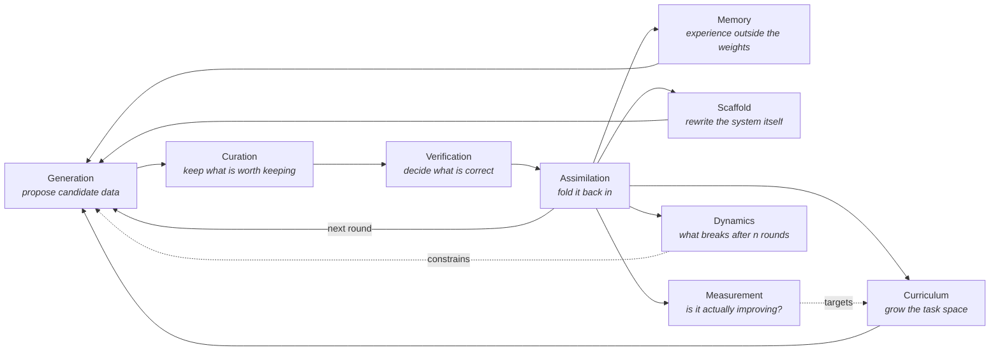

<!--
  This file is the TEMPLATE for README.md.
  Prose lives here and is hand-edited; {{placeholders}} are filled by
  scripts/build.py from data/. Run `make build` after editing.
-->
<div align="center">

# Awesome Data-Centric Recursive Self-Improvement

**A curated, machine-checked survey of systems that get better by improving their own data.**

{{badges}}

{{summary}}

</div>

---

## Scope

**Recursive self-improvement (RSI)** is usually told as a story about weights: a model
trains a better model, which trains a better model. In practice, almost every working
loop today improves *the data* instead - what gets generated, what gets kept, what gets
verified, and what comes back as training signal. This list tracks that literature.

An entry belongs here when it answers at least one of these, **inside a loop**:

- Where does new training data come from when the annotators run out?
- What decides whether a generated sample is worth learning from?
- What happens to a system that has been consuming its own output for *n* rounds?
- What does the loop leave behind - weights, a corpus, a skill library, its own source code?

Out of scope: data work with no feedback into the system that produced it, model
architecture or optimiser work with a fixed corpus, and capability reports without a
described loop. The full rules, including how borderline cases are decided, are in
[docs/methodology.md](docs/methodology.md).

## The loop



The nine sections of this list are the nine boxes above. An entry is filed under the box
its contribution lands on and tagged with every other box it touches.

## At a glance

{{figures}}

## How to read an entry

Every entry carries the same six dimensions, so the list can be re-cut along any of them
(see [docs/index-by-dimension.md](docs/index-by-dimension.md)):

{{legend}}

An entry line looks like this:

> - **[Paper title](https://arxiv.org/abs/0000.00000)** · Author et al. · Venue 2024 · [code](https://example.com)<br>
>   <sub>One sentence on what the loop does.</sub><br>
>   <sub>**loop** `iterated` · **signal** `verifier` · **also** `curation` · **artefact** `data` `weights` · **domain** `math` · **type** `method`</sub>

`loop` is the recursion depth, `signal` is what separates good data from bad, `also`
lists the other stages the work touches, and `artefact` is what the loop leaves changed.

## Contents

{{toc}}

- [Contributing](#contributing) · [How this list stays correct](#how-this-list-stays-correct) · [Citation](#citation)

---

{{entries}}

---

## How this list stays correct

A survey rots unless the rules are executable. Everything in this repository except
`data/` and the prose in `templates/` is generated, and every pull request is checked
by CI before a human reads it:

| Gate | What it enforces |
| --- | --- |
| `make validate` | Schema, controlled vocabulary, id/year/arXiv agreement, duplicates, TL;DR style, per-entry editorial rules |
| `make build` + drift check | README, docs, JSON Schema, `data/derived/*` and the issue form match `data/` exactly |
| `make test` | The rule engine itself, on fixtures of deliberately broken entries |
| `make fix` | Rewrites every entry in the one canonical spelling, so diffs are semantic |
| Link check | Every URL resolves; arXiv titles, authors and years match what the entry claims |

Each rule has a stable code (`E1xx` fatal, `W2xx` advisory) that CI prints with the file
it fired on - see [CONTRIBUTING.md](CONTRIBUTING.md#rule-codes).

## Contributing

Adding a paper is one YAML file:

```bash
git clone https://github.com/xubinrui/Awesome-Data-Centric-RSI
cd Awesome-Data-Centric-RSI
make install

make new ARXIV=2505.03335   # fetches the metadata and writes a labelled stub
$EDITOR data/entries/<id>.yaml
make fix && make check      # format, validate, regenerate, test
```

Then open a pull request. The [contributing guide](CONTRIBUTING.md) explains each field,
the labelling conventions, and what a reviewer looks at that CI cannot.

The most useful contributions are listed as **coverage gaps** in
[docs/stats.md](docs/stats.md#coverage-gaps): vocabulary terms that no entry uses yet.

## Related lists

- [awesome](https://github.com/sindresorhus/awesome) - the root of all awesome lists
- [Awesome-LLM](https://github.com/Hannibal046/Awesome-LLM) - general large language model reading list
- [data-selection-survey](https://github.com/alon-albalak/data-selection-survey) - companion list for the curation section

## Citation

```bibtex
@misc{awesome-data-centric-rsi,
  title  = {Awesome Data-Centric Recursive Self-Improvement},
  author = {Contributors},
  year   = {{{year}}},
  note   = {A curated, machine-checked survey of data-centric self-improvement loops},
  url    = {https://github.com/xubinrui/Awesome-Data-Centric-RSI}
}
```

Machine-readable metadata for the list itself is in [CITATION.cff](CITATION.cff); the
entries are available as [JSON](data/derived/entries.json) and
[CSV](data/derived/entries.csv) for reuse.

## License

List content (`data/`, `docs/`, `README.md`) is [CC BY 4.0](LICENSE); the tooling in
`scripts/` and `tests/` is [MIT](LICENSE-CODE).
